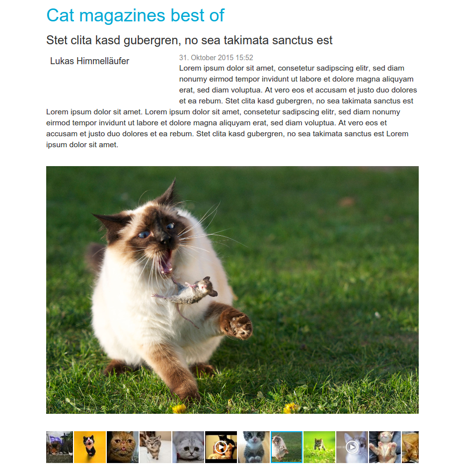

# PencilBlue-Picture-Service

This project is a plugin for the CMS [PencilBlue](https://pencilblue.org/).

It provides two main functionalities:
* a PencilBlue-service that allows to deliver resized pictures that are stored as "media" and which is designed to be reused in other projects
* optionally an extended "article" visualization that shows a picture gallery below the actual article

There are mainly 3 ways how this service can be used.
1. Have your article view enriched by a gallery showing all your media (this can be disabled)
2. Use a dedicated media route, that allows resizing pictures to a target format by passing on parameters (this can be disabled)
3. Use the picture-resize-service programatically for your own project.

##1. The gallery view

The  [Fotorama](http://fotorama.io/) gallery library is used here. It can be altered by changing the templates or it can be replaced by virtually any other gallery / carousel library via templates.

##2. How the picture service route work


##3. Using the service

```javascript
...
var PictureService = pb.PluginService.getService('PictureService', 'PencilBlue-Picture-Service');
var mediaId = '/media/2015/11/ceb046e8-3977-4ca2-9d5a-4ffb26891d4f-1448798830584.jpg';
var expectedSize = {
    width: 128,
    height: 128,
    maxWidth: undefined,
    maxHeight: undefined,
    quality: 60
};
pictureService.getPictureStream(mediaId, expectedSize, function(err, stream, info){
    if(err !== null)  {
        pb.log.error("getPictureStream failed: " + err.description);
        self.reqHandler.serveError(err);
        return;
    }
    stream.once('error', function(err) {
        pb.log.error("Picturestream failed: " + err.description);
    });
    if (info.mimeType) {
        self.res.setHeader('Content-Type', info.mimeType);
    }
    if (info.streamLength) {
        self.res.setHeader('Content-Length', info.streamLength);
    }

    stream.pipe(self.res);
});
...
```

#Installation

1. Checkout or download this project
2. Place it in your plugin-folder named "PencilBlue-Picture-Service"


# The gallery templates

##Features
* Comes with the [Fotorama](http://fotorama.io/) gallery library 
- Gallery can be highly customized
- Gallery can be replaced by altering the templates
- Adds localization features for displaying dates and time
- The gallery can be disabled from settings

##Template placeholders:
| Placeholder   |  Comments |
| ------------- | ----------|
|article_timestamp_L   | Example: 2015-11-30|
|article_t#imestamp_l   | Example: 2015-11-30|
|article_timestamp_LL   | Example: 30 November, 2015|
|article_timestamp_ll   | Example: 30 Nov, 2015|
|article_timestamp_LLL   | Example: 30 November, 2015 10:57 PM|
|article_timestamp_lll   | Example: 30 Nov, 2015 10:57 PM|
|article_timestamp_LLLL   | Example: Monday, 30 November, 2015 10:57 PM|
|article_timestamp_llll   | Example: Mon, 30 Nov, 2015 10:57 PM        |
|article_timestamp_LT   | Example: 8:30 PM|
|article_timestamp_LTS   | Example: 8:30:25 PM|
|tmp_elements=article=gallery|Insert the gallery here|
|article_gallery_elements|put here the list of single images|
|article_gallery_elem_url|The URL to a media file|
|article_gallery_elem_caption|The caption of a media file|
|article_gallery_elem_name|The caption of a media file|


All timestamps are being translated to the browsers prefered language using MomentJS. Please refer to their [start page](http://momentjs.com/) to find examples of how these formats behave in other languages.

##Plugin settings
| Option        | Values        |  Comments |
| ------------- |---------------| ----------|
| Gallery_Enabled | true\|false | If false, the original PencilBlue content-view-loader is used  |
| Max_Width      | integer      | if neither target witdh nor height is provided, than images are not returned wider than defined  |
| Max_Height      | integer      | if neither target witdh nor height is provided, than images are not returned wider than defined (If Max_Width is defined, this setting will be ignored)   |
| Quality_Regular      | 1-100      | The JPEG / WebP picture / compression quality of regular pictures (none-thumbnails)| 
| Quality_Thumbnail      | 1-100      | The JPEG / WebP picture / compression quality of thumbnails  | 


#The picture service route

##Features


##Route Format

A new route is added that allows image manipulations. The route

> /PicService/2015/11/6bd30f4b-4034-4eaf-83e5-eb5d34f00bf4-1448798846040.jpg

A media link can be transformed to this route by simply replacing "/media/ by "/PicService/".

In addition this route can contain additional request parameters encoded in the URL. Parameters are not passed over as part of the query (behind ?) in order to allow browsers and routers to cache those files. Parameters are separated by an underscore character (_).

> /PicService/2015/11/6bd30f4b-4034-4eaf-83e5-eb5d34f00bf4-1448798846040.jpg/@PAR_H64_W64_Qthumb

Request parameters:

| Parameter        | Comment        |  
| ------------- |---------------| 
| @PAR     | Indicator that parameters follow, must be the last segment of the route |
| H[Integer] | Target height. The value must be listed in the plusign setting "Valid_Width_List". If not, the value will be ignored (see "flooding attack" below) |
| W[Integer] | Target width. The value must be listed in the plusign setting "Valid_height_List". If not, the value will be ignored (see "flooding attack" below)|
| Qthumb | If defined the image is returned with the  quality defined in Quality_Thumbnail. Otherwise the quality defined in Quality_Regular is used|


##Plugin settings

| Option        | Values        |  Comments |
| ------------- |---------------| ----------|
|  Picture Service Route Enabled     | true\|false      | If false, the route will return 404-errors |
| Picture_Service_Cache_Path | pathname | base directory used for caching manipulated pictures. By default the os temp folder. Below this folder this plugin creaes it's subfolder called "pb_picture_cache". This subfolder can be removed anytime with no harm to the the application. |
| Do_Cache | true\|false | Default is true. Set to false, no caching is done. Pictures get recalculated with every request.|
| Valid_Width_List | comma separated integers | List of allowed width parameters in image request URL (see "Disk flooding attacks" below) |
| Valid_Hight_List | comma separated integers | List of allowed height parameters in image request URL (see "Disk flooding attacks" below) |
Also the settings Quality_Regular, Quality_Thumbnail, Max_Height, Max_Width desribed above apply here.


##Disk flooding attacks
This project comes by default with a route that allows defining as part of the route the expected width and height of the image. If no countermeasures are taken, this would create a vulnurabilities:
1. Adversaries could try to send in large target width / height values in order to crash the server.
2. Adversaries could try to request a all possible none-crashing permutations of widht, height and width/height for every picture available to flood the cash folder and ultimately have the server run out of space.

In order to circumvent such attacks the "allowed" width and height values have to be predefined in the plugin settings (Valid_Width_List, Valid_Hight_List). If a width/height does not comply to those values it gets removed from the requested paramter list.


#The service

##Features
- Picture can be proportionally scaled by defining the target length
- Picture can be proportionally scaled by defining the target width
- Picture can be proportionally scaled by defining the target length and width. The picture is getting automatically croped if needed to its center.
- Alternative to defining length/widht either a max-length or max-width can be defined. This can improve load times by limiting oversized picture to 'reasonable' dimensions
- The output picture quality can be defined (JPEG, WebP, )
- Resized pictures are being cached to reduce processor load
- Caching can be disabled (enabled by default)
- Default cache directory is the the os temp-directory
- template choosing


##Usage / Examples

// TODO add screenshots and source code

proportionally scaled by defining the target length


proportionally scaled by defining the target width


proportionally scaled by defining the target length and width and crop to center


##Define quality


##Plugin settings

Also the settings Do_Cache, Picture_Service_Cache_Path desribed above apply here.


#Credits
* [Fotorama](http://fotorama.io/) Gallery / carousel library
* [Sharp](http://sharp.dimens.io/en/stable/) NodeJS image library
* [MomentJS](http://momentjs.com/) A time/date library allowing i18n
