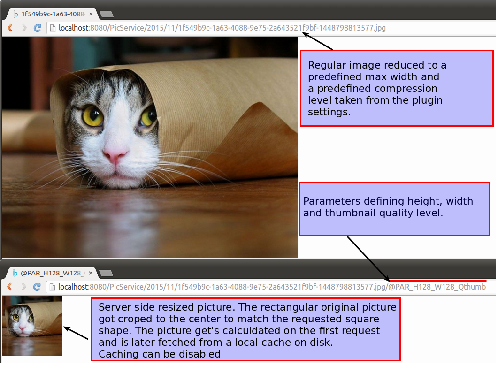

# PencilBlue-Picture-Service

This project is a plugin for the CMS [PencilBlue](https://pencilblue.org/).

It provides two main functionalities:
* a PencilBlue-service that allows to deliver resized pictures that are stored as "media" and which is designed to be reused in other projects
* optionally an extended "article" visualization that shows a picture gallery below the actual article

There are mainly 3 ways how this service can be used.
1. Have your article view enriched by a gallery showing all your media (this can be disabled)
2. Use a dedicated media link, that allows resizing pictures to a target format by passing on parameters (this can be disabled)
3. Use the picture-resize-service programatically for your own project.

##1. The gallery view

The gallery library from [Fotorama](http://fotorama.io/) is used here. It can be altered by changing the templates or it can be replaced by virtually any other gallery / carousel library.

##2. How the link works


##3. Using the service

```javascript
...
var PictureService = pb.PluginService.getService('PictureService', 'PencilBlue-Picture-Service');
var mediaId = '/media/2015/11/ceb046e8-3977-4ca2-9d5a-4ffb26891d4f-1448798830584.jpg';
var expectedSize = {
    width: 128,
    height: 128,
    maxWidth: undefined,
    maxHeight: undefined,
    quality: 60
};
pictureService.getPictureStream(mediaId, expectedSize, function(err, stream, info){
    if(err !== null)  {
        pb.log.error("getPictureStream failed: " + err.description);
        self.reqHandler.serveError(err);
        return;
    }
    stream.once('error', function(err) {
        pb.log.error("Picturestream failed: " + err.description);
    });
    if (info.mimeType) {
        self.res.setHeader('Content-Type', info.mimeType);
    }
    if (info.streamLength) {
        self.res.setHeader('Content-Length', info.streamLength);
    }

    stream.pipe(self.res);
});
...
```


// TODO link to Fotorama
Possible use cases:
- Provide image thumbnails
- Provide images at a standardized with and/or height
- Improve load times by serving JPEGs at a lower quality
- Use pictures for a picture gallery or carusell (Project is shipped with Fotorama, it can be used with virtually an other alternative).


By default the plugin changes the article visualization to this:
// TODO add screenshot


The service
------------

Features
- Picture can be proportionally scaled by defining the target length
- Picture can be proportionally scaled by defining the target width
- Picture can be proportionally scaled by defining the target length and width. The picture is getting automatically croped if needed to its center.
- Alternative to defining length/widht either a max-length or max-width can be defined. This can improve load times by limiting oversized picture to 'reasonable' dimensions
- The output picture quality can be defined (JPEG, WebP, )
- Resized pictures are being cached to reduce processor load
- Caching can be disabled (enabled by default)
- Default cache directory is the the os temp-directory


Installation
------------

1. Checkout or download this project
2. Place it in your plugin-folder named "PencilBlue-Picture-Service"


Usage / Examples
----------------

// TODO add screenshots and source code

proportionally scaled by defining the target length


proportionally scaled by defining the target width


proportionally scaled by defining the target length and width and crop to center


Define quality


Configuration

Picture_Service_Cache_Path: base directory used for caching manipulated pictures. By default the os temp folder. Below this folder this plugin creaes it's subfolder called "pb_picture_cache". This subfolder can be removed anytime with no harm to the the application.

Do_Cache: true/false - Default is true. Set to false, no caching is done. Pictures get recalculated with every request.

Valid_Width_List: Comma separted list of allowed width parameters in image request URL (see "Disk flooding attacks" below)
Valid_Hight_List: Comma separted list of allowed height parameters in image request URL (see "Disk flooding attacks" below)

Disk flooding attacks
This project comes by default with a route that allows defining as part of the route the expected with and height of the image. If no countermeasures are taken, this would create a vulnurabilities:
1. Adversaries could try to send in large target width / height values in order to crash the server.
2. Adversaries could try to request a all possible none-crashing permutations of widht, height and width/height for every picture available to flood the cash folder and ultimately have the server run out of space.

In order to circumvent such attacks the "allowed" width and height values have to be predefined in the plugin settings (Valid_Width_List, Valid_Hight_List). If a width/height does not comply to those values it gets removed from the requested paramter list.


The article view with galley
----------

Features
- Gallery
- time
- template choosing


Usage 

URL Format


Template placeholders:
Under revision, changes to be expected. Plus better/internationalized time/date support.

// TODO add all the new article placeholders
Configuration
Gallery_Enabled
Max_Width
Max_Height
Quality_Regular
Quality_Thumbnail


Credits
----------
Fotorama an awesome versatile gallery and carussel library: http://fotorama.io/
Sharp a great NodeJS picture manipulation library: http://sharp.dimens.io/en/stable/
